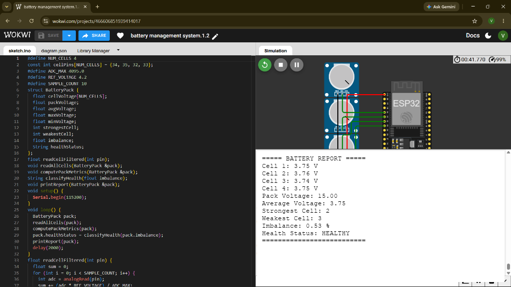
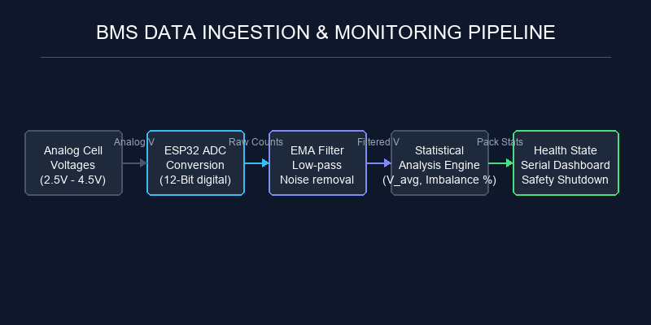
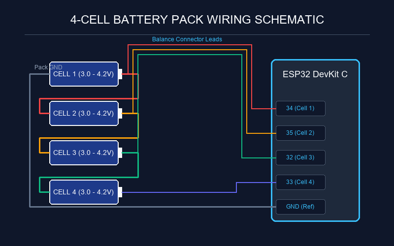

# Adaptive Multi-Cell Battery Intelligence Engine


A production-grade, real-time embedded Battery Management System (BMS) software engine designed to monitor a 4-cell lithium battery pack. Implemented using scalable, modular C++ object-oriented principles on an **ESP32** microcontroller, the system samples cell voltages, filters high-frequency noise, calculates pack average and total voltage, determines imbalance percentages, and diagnoses pack health.

---

## Demo Output



---

## Key Features

- **Decoupled Architecture**: Separation of sensor data acquisition (`BatteryMonitor`) from diagnostic decision-making (`HealthClassifier`).
- **Signal Filtering**: Exponential Moving Average (EMA) Infinite Impulse Response (IIR) filter to suppress noise.
- **Statistical Analytics**: Computes real-time average voltage, pack total, absolute imbalance, percentage imbalance, and dynamically identifies the weakest/strongest cells.
- **Diagnostics**: Multi-level safety-critical classifier categorization:
  - `HEALTHY` (normal operation)
  - `MINOR IMBALANCE` (active balancing recommended)
  - `CRITICAL IMBALANCE` (current limits recommended)
  - `PACK FAILURE` (safety contactor open / pack shutdown)
- **Over/Under Voltage Protection**: Automatic alarms when individual cell voltages exceed safe operational thresholds.
- **Interactive Wokwi Simulation**: Ready-to-run interactive hardware-in-the-loop simulation.

---

## System Overview & Architecture

### Ingestion Pipeline
The engine ingests analog voltages, digitizes them via the ESP32 SAR ADC, applies noise filters, computes pack statistics, and executes the state machine logic:



### Hardware Connections
The battery pack contains four lithium cells in series. Balance leads run from each cell junction to the analog ADC pins on the ESP32 DevKit C:



---

## Safety Threshold Matrix

The system monitors individual cell voltages (Vcell) and percentage imbalance (ΔV%):

| Health State | Voltage Limits | Imbalance Threshold | BMS Action |
| :--- | :--- | :--- | :--- |
| **HEALTHY** | 3.00V ≤ Vcell ≤ 4.25V | < 1.50% | Normal operations. Indicators off/green. |
| **MINOR IMBALANCE** | 3.00V ≤ Vcell ≤ 4.25V | 1.50% ≤ ΔV% < 5.00% | Alarm Warning. Enable active balancing circuit. |
| **CRITICAL IMBALANCE** | 2.80V ≤ Vcell ≤ 4.25V | 5.00% ≤ ΔV% < 10.00% | Alarm Alert. Reduce load current to save cell pack. |
| **PACK FAILURE** | Vcell < 2.80V or Vcell > 4.25V | ≥ 10.00% | Critical Fault. Open safety contactors; isolate pack. |

---

## Technologies Used

- ESP32 DevKit V4
- Embedded C++
- Object-Oriented Programming
- ADC Signal Processing
- Exponential Moving Average (EMA)
- Battery Management Systems (BMS)
- Wokwi Simulation

---

## File Structure

```
Adaptive-Multi-Cell-Battery-Intelligence-Engine/
├── README.md
├── LICENSE
├── .gitignore
├── docs/
│   ├── Project_Report.pdf             # Executive Architecture & Report (PDF)
│   ├── Architecture_Diagram.png       # Hardware & Software Layer Intersections
│   ├── Flowchart.png                  # Diagnosis Decision Tree Flow
│   └── Screenshots/                   # State Verification Screenshots
│       ├── healthy_state.png          # Normal operational report (0.50% imbalance)
│       ├── minor_imbalance.png        # Warning report (2.91% imbalance)
│       ├── critical_imbalance.png     # Alert report (5.94% imbalance)
│       ├── pack_failure.png           # Pack Failure fault report
│       └── simulation_running.png     # Real-time monitoring dashboard
├── src/
│   ├── main.ino                       # ESP32 main program setup, loop, & demo cycle
│   ├── battery_monitor.h              # BatteryMonitor class declaration
│   ├── battery_monitor.cpp            # Analog reading, smoothing, & stats implementation
│   ├── health_classifier.h            # HealthClassifier class & state enum declaration
│   └── health_classifier.cpp          # Diagnosis rules & warning flag implementation
├── simulation/
│   ├── diagram.json                   # Wokwi circuit schematic config
│   └── wokwi-project-link.txt         # Online simulator URL
└── results/
    ├── sample_output_1.txt            # Serial dashboard logs for demo cycle
    ├── sample_output_2.txt            # Serial logs for real-time fault transitions
    └── performance_analysis.md        # Technical analysis on ADC, EMA, and FPU metrics
```

---

## Future Enhancements

- **Active Cell Balancing**: Integrating bi-directional flyback converters for transfer of charge between cells.
- **CAN Bus Integration**: Implementing SAE J1939 or CANopen protocol interface for vehicular communications.
- **MQTT Cloud Monitoring**: Transmitting cell metrics over WiFi to an IoT Cloud dashboard.
- **State of Charge (SOC) Estimation**: Applying Extended Kalman Filtering (EKF) or coulomb counting algorithms.
- **State of Health (SOH) Analytics**: Tracking cell degradation parameters and impedance changes over time.
- **OLED Dashboard Interface**: Adding physical I2C SSD1306 display screen for on-site diagnostics.

---

## Wokwi Simulation

The project is fully simulated in Wokwi using an ESP32 board and 4 slide potentiometers simulating the cells.

- **Simulation Link**: [Wokwi Simulation Project](https://wokwi.com/projects/466606851939414017)

To run the simulation:
1. Open the project link.
2. Click the **Start the simulation** button (green play icon).
3. The console will display a **20-second automated demo sequence** cycling through the 4 states:
   - **0-5s**: Healthy State (Cell voltages: 4.01V, 4.00V, 4.02V, 4.00V)
   - **5-10s**: Minor Imbalance (Cell voltages: 4.12V, 4.00V, 4.07V, 4.05V)
   - **10-15s**: Critical Imbalance (Cell voltages: 4.21V, 3.98V, 4.15V, 3.96V)
   - **15-20s**: Pack Failure (Cell voltages: 4.30V, 3.85V, 4.10V, 3.75V)
4. After 20 seconds, the engine enters **Real-time Monitoring mode** and reads the actual slide positions of the potentiometers. Slide them to change voltages and observe the dynamic report recalculations and warning flags in real time!
